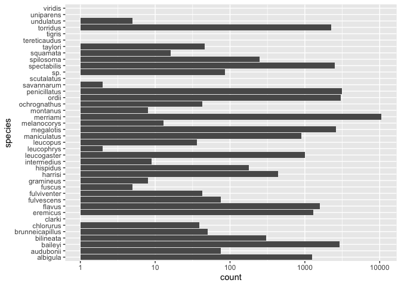
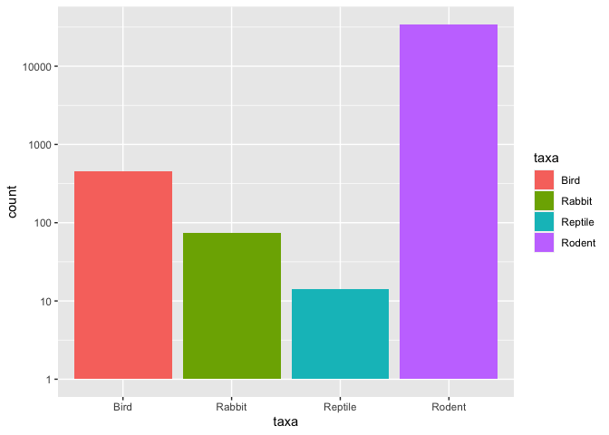
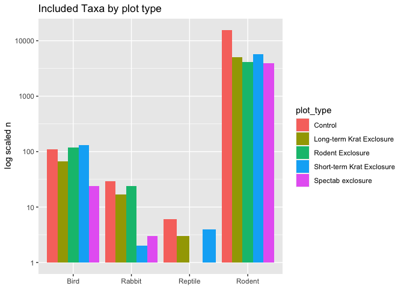
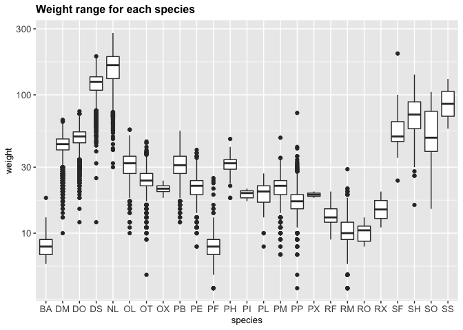
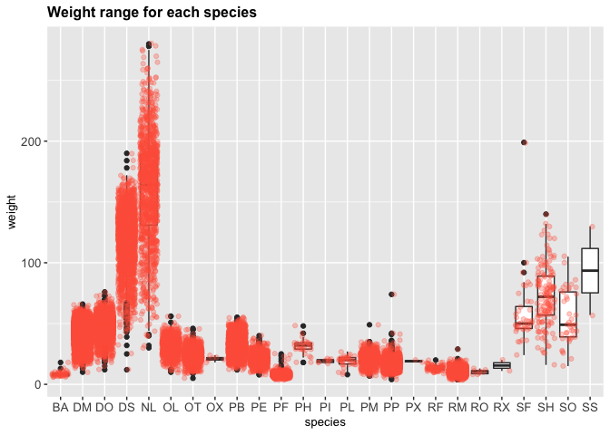
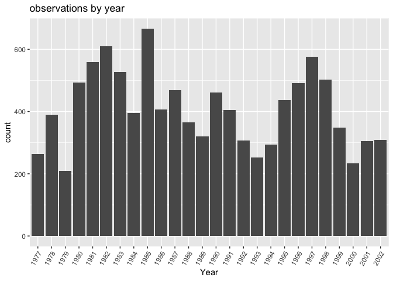
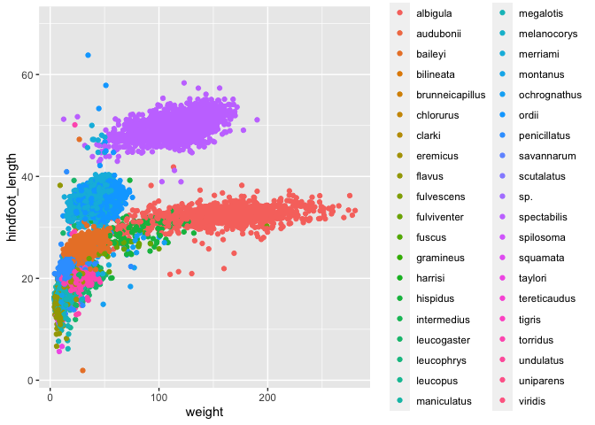
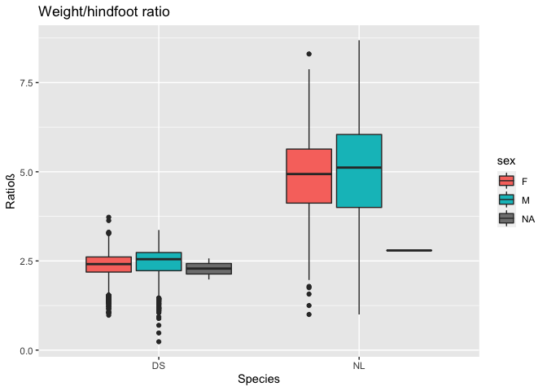

## Instructions
Answer the following questions and complete the exercises in RMarkdown. Please embed all of your code and push your final work to your repository. Your final lab report should be organized, clean, and run free from errors. Remember, you must remove the `#` for the included code chunks to run. Be sure to add your name to the author header above. For any included plots, make sure they are clearly labeled. You are free to use any plot type that you feel best communicates the results of your analysis.  

Make sure to use the formatting conventions of RMarkdown to make your report neat and clean!  

## Load the libraries

```r
library(tidyverse)
library(janitor)
library(here)
library(naniar)
```

## Desert Ecology
For this assignment, we are going to use a modified data set on [desert ecology](http://esapubs.org/archive/ecol/E090/118/). The data are from: S. K. Morgan Ernest, Thomas J. Valone, and James H. Brown. 2009. Long-term monitoring and experimental manipulation of a Chihuahuan Desert ecosystem near Portal, Arizona, USA. Ecology 90:1708.

```r
deserts <- read_csv(here("lab10", "data", "surveys_complete.csv"))
```

```
## Rows: 34786 Columns: 13
```

```
## ── Column specification ────────────────────────────────────────────────────────
## Delimiter: ","
## chr (6): species_id, sex, genus, species, taxa, plot_type
## dbl (7): record_id, month, day, year, plot_id, hindfoot_length, weight
```

```
## 
## ℹ Use `spec()` to retrieve the full column specification for this data.
## ℹ Specify the column types or set `show_col_types = FALSE` to quiet this message.
```

1. Use the function(s) of your choice to get an idea of its structure, including how NA's are treated. Are the data tidy? 

```r
head(deserts)
```

```
## # A tibble: 6 × 13
##   record_id month   day  year plot_id species_id sex   hindfoot_length weight
##       <dbl> <dbl> <dbl> <dbl>   <dbl> <chr>      <chr>           <dbl>  <dbl>
## 1         1     7    16  1977       2 NL         M                  32     NA
## 2         2     7    16  1977       3 NL         M                  33     NA
## 3         3     7    16  1977       2 DM         F                  37     NA
## 4         4     7    16  1977       7 DM         M                  36     NA
## 5         5     7    16  1977       3 DM         M                  35     NA
## 6         6     7    16  1977       1 PF         M                  14     NA
## # … with 4 more variables: genus <chr>, species <chr>, taxa <chr>,
## #   plot_type <chr>
```

```r
names(deserts)
```

```
##  [1] "record_id"       "month"           "day"             "year"           
##  [5] "plot_id"         "species_id"      "sex"             "hindfoot_length"
##  [9] "weight"          "genus"           "species"         "taxa"           
## [13] "plot_type"
```


```r
naniar::miss_var_summary(deserts)
```

```
## # A tibble: 13 × 3
##    variable        n_miss pct_miss
##    <chr>            <int>    <dbl>
##  1 hindfoot_length   3348     9.62
##  2 weight            2503     7.20
##  3 sex               1748     5.03
##  4 record_id            0     0   
##  5 month                0     0   
##  6 day                  0     0   
##  7 year                 0     0   
##  8 plot_id              0     0   
##  9 species_id           0     0   
## 10 genus                0     0   
## 11 species              0     0   
## 12 taxa                 0     0   
## 13 plot_type            0     0
```

```r
glimpse(deserts)
```

```
## Rows: 34,786
## Columns: 13
## $ record_id       <dbl> 1, 2, 3, 4, 5, 6, 7, 8, 9, 10, 11, 12, 13, 14, 15, 16,…
## $ month           <dbl> 7, 7, 7, 7, 7, 7, 7, 7, 7, 7, 7, 7, 7, 7, 7, 7, 7, 7, …
## $ day             <dbl> 16, 16, 16, 16, 16, 16, 16, 16, 16, 16, 16, 16, 16, 16…
## $ year            <dbl> 1977, 1977, 1977, 1977, 1977, 1977, 1977, 1977, 1977, …
## $ plot_id         <dbl> 2, 3, 2, 7, 3, 1, 2, 1, 1, 6, 5, 7, 3, 8, 6, 4, 3, 2, …
## $ species_id      <chr> "NL", "NL", "DM", "DM", "DM", "PF", "PE", "DM", "DM", …
## $ sex             <chr> "M", "M", "F", "M", "M", "M", "F", "M", "F", "F", "F",…
## $ hindfoot_length <dbl> 32, 33, 37, 36, 35, 14, NA, 37, 34, 20, 53, 38, 35, NA…
## $ weight          <dbl> NA, NA, NA, NA, NA, NA, NA, NA, NA, NA, NA, NA, NA, NA…
## $ genus           <chr> "Neotoma", "Neotoma", "Dipodomys", "Dipodomys", "Dipod…
## $ species         <chr> "albigula", "albigula", "merriami", "merriami", "merri…
## $ taxa            <chr> "Rodent", "Rodent", "Rodent", "Rodent", "Rodent", "Rod…
## $ plot_type       <chr> "Control", "Long-term Krat Exclosure", "Control", "Rod…
```

2. How many genera and species are represented in the data? What are the total number of observations? Which species is most/ least frequently sampled in the study?

```r
deserts %>% 
  count(genus, species, sort=T) #sort=T)
```

```
## # A tibble: 48 × 3
##    genus           species          n
##    <chr>           <chr>        <int>
##  1 Dipodomys       merriami     10596
##  2 Chaetodipus     penicillatus  3123
##  3 Dipodomys       ordii         3027
##  4 Chaetodipus     baileyi       2891
##  5 Reithrodontomys megalotis     2609
##  6 Dipodomys       spectabilis   2504
##  7 Onychomys       torridus      2249
##  8 Perognathus     flavus        1597
##  9 Peromyscus      eremicus      1299
## 10 Neotoma         albigula      1252
## # … with 38 more rows
```


```r
deserts %>% 
  count(species, sort=T)
```

```
## # A tibble: 40 × 2
##    species          n
##    <chr>        <int>
##  1 merriami     10596
##  2 penicillatus  3123
##  3 ordii         3027
##  4 baileyi       2891
##  5 megalotis     2609
##  6 spectabilis   2504
##  7 torridus      2249
##  8 flavus        1597
##  9 eremicus      1299
## 10 albigula      1252
## # … with 30 more rows
```


```r
deserts %>% 
  ggplot(aes(species)) + #x=reorder(order, mean_mass), y=mean_mass))
  geom_bar()+
  coord_flip()+
  scale_y_log10()
```

<!-- -->

*note: this is the right one, omg I made this way harder than it needed to be*

```r
deserts %>%
  summarize(n_genera=n_distinct(genus),
            n_species=n_distinct(species),
            n=n())
```

```
## # A tibble: 1 × 3
##   n_genera n_species     n
##      <int>     <int> <int>
## 1       26        40 34786
```

3. What is the proportion of taxa included in this study? Show a table and plot that reflects this count.

```r
deserts %>% 
  count(taxa)
```

```
## # A tibble: 4 × 2
##   taxa        n
##   <chr>   <int>
## 1 Bird      450
## 2 Rabbit     75
## 3 Reptile    14
## 4 Rodent  34247
```


```r
deserts %>% 
  group_by(taxa) %>% 
  ggplot(aes(x=taxa, fill=taxa))+
  geom_bar()+
  scale_y_log10()
```

<!-- -->

4. For the taxa included in the study, use the fill option to show the proportion of individuals sampled by `plot_type.`

```r
deserts %>% 
  group_by(taxa) %>% 
  ggplot(aes(x=taxa, fill=plot_type))+
  geom_bar()+
  scale_y_log10()
```

<!-- -->
*note: could have also done this (stolen from Joel)*

```r
deserts %>% 
  ggplot(aes(x=taxa, fill=plot_type)) + geom_bar(position="dodge") +
  scale_y_log10()+
  theme(axis.text.x = element_text(hjust = 0.5)) +
  labs(title = "Included Taxa by plot type",
       x = NULL,
       y= " log scaled n")
```

<!-- -->

5. What is the range of weight for each species included in the study? Remove any observations of weight that are NA so they do not show up in the plot.

```r
names(deserts)
```

```
##  [1] "record_id"       "month"           "day"             "year"           
##  [5] "plot_id"         "species_id"      "sex"             "hindfoot_length"
##  [9] "weight"          "genus"           "species"         "taxa"           
## [13] "plot_type"
```

```r
deserts %>% 
  filter(weight!="NA") %>% 
  ggplot(aes(x=species_id, y=weight)) +  #, na.rm=T))+ *this is a mistake*
  geom_boxplot()+
  scale_y_log10()+
  labs(title="Weight range for each species", #adding labels
       x="species",
       y="weight")+
  theme(plot.title = element_text(size = 12, face = "bold"),
        axis.text = element_text(size = 10),
        axis.title = element_text(size = 10))
```

<!-- -->

6. Add another layer to your answer from #4 (#5?) using `geom_point` to get an idea of how many measurements were taken for each species.

```r
deserts %>% 
  filter(weight!="NA") %>% 
  ggplot(aes(x=species_id, y=weight))+
  geom_boxplot()+
  geom_point(alpha=0.3, color="tomato", position = "jitter") +
  #scale_y_log10()+
  labs(title="Weight range for each species", #adding labels
       x="species",
       y="weight")+
  theme(plot.title = element_text(size = 12, face = "bold"),
        axis.text = element_text(size = 10),
        axis.title = element_text(size = 10))
```

<!-- -->

7. [Dipodomys merriami](https://en.wikipedia.org/wiki/Merriam's_kangaroo_rat) is the most frequently sampled animal in the study. How have the number of observations of this species changed over the years included in the study?

```r
deserts %>% 
  filter(species=="merriami") %>% 
  group_by(year) %>% 
  summarize(n_samples=n())
```

```
## # A tibble: 26 × 2
##     year n_samples
##    <dbl>     <int>
##  1  1977       264
##  2  1978       389
##  3  1979       209
##  4  1980       493
##  5  1981       559
##  6  1982       609
##  7  1983       528
##  8  1984       396
##  9  1985       667
## 10  1986       406
## # … with 16 more rows
```

```r
deserts %>% 
  filter(species_id=="DM") %>% 
  group_by(year) %>% 
  summarize(n_samples=n()) %>% 
  ggplot(aes(x=as.factor(year), y=n_samples)) + geom_col()+
  theme(axis.text.x = element_text(angle = 60, hjust = 1)) + #stolen from Joel
  labs(title = "observations by year",
       x = "Year",
       y= "count")
```

<!-- -->

8. What is the relationship between `weight` and `hindfoot` length? Consider whether or not over plotting is an issue.

```r
deserts %>% 
  ggplot(aes(x=weight, y=hindfoot_length, col=species))+
  geom_jitter(na.rm=T)
```

<!-- -->

9. Which two species have, on average, the highest weight? Once you have identified them, make a new column that is a ratio of `weight` to `hindfoot_length`. Make a plot that shows the range of this new ratio and fill by sex.

```r
deserts %>% 
  filter(weight!="NA") %>% 
  group_by(species) %>% 
  summarize(mean_weight=mean(weight)) %>% 
  arrange(desc(mean_weight))
```

```
## # A tibble: 22 × 2
##    species      mean_weight
##    <chr>              <dbl>
##  1 albigula           159. 
##  2 spectabilis        120. 
##  3 spilosoma           93.5
##  4 hispidus            65.6
##  5 fulviventer         58.9
##  6 ochrognathus        55.4
##  7 ordii               48.9
##  8 merriami            43.2
##  9 baileyi             31.7
## 10 leucogaster         31.6
## # … with 12 more rows
```

```r
weight_foot_ratio <- deserts %>% 
  filter(species=="albigula" | species=="spectabilis") %>% 
  filter(weight!="NA" & hindfoot_length!="NA") %>% 
  mutate(ratio=weight/hindfoot_length) %>% 
  select(species_id, sex, weight, hindfoot_length, ratio)
weight_foot_ratio
```

```
## # A tibble: 3,072 × 5
##    species_id sex   weight hindfoot_length ratio
##    <chr>      <chr>  <dbl>           <dbl> <dbl>
##  1 DS         F        117              50  2.34
##  2 DS         F        121              51  2.37
##  3 DS         M        115              51  2.25
##  4 DS         F        120              48  2.5 
##  5 DS         F        118              48  2.46
##  6 DS         F        126              52  2.42
##  7 DS         M        132              50  2.64
##  8 DS         F        122              53  2.30
##  9 DS         F        107              48  2.23
## 10 DS         F        115              50  2.3 
## # … with 3,062 more rows
```

```r
weight_foot_ratio %>% 
  ggplot(aes(x=species_id, y=ratio, fill=sex)) + geom_boxplot()+
  labs(title = "Weight/hindfoot ratio",
       x = "Species",
       y = "Ratioß")
```

<!-- -->

10. Make one plot of your choice! Make sure to include at least two of the aesthetics options you have learned.


## Push your final code to GitHub!
Please be sure that you check the `keep md` file in the knit preferences. 
