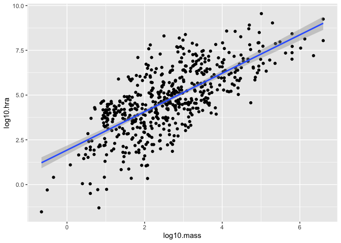
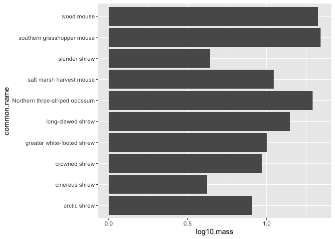

## Learning Goals
*At the end of this exercise, you will be able to:*    
1. Understand and apply the syntax of building plots using `ggplot2`.  
2. Build a boxplot using `ggplot2`.  
3. Build a scatterplot using `ggplot2`.  
4. Build a barplot using `ggplot2` and show the difference between `stat=count` and `stat=identity`.  

## Where have we been, and where are we going?
At this point you should feel comfortable working in RStudio and using `dplyr` and `tidyr.` You also know how to produce statistical summaries of data and deal with NA's. It is OK if you need to go back through the labs and find bits of code that work for you, but try and force yourself to originate new chunks.   

##Resources  
- [ggplot2 cheatsheet](https://www.rstudio.com/wp-content/uploads/2015/03/ggplot2-cheatsheet.pdf)  

## Libraries

```r
library(tidyverse)
library(naniar)
library(janitor)
library(here)
```

## Grammar of Graphics
The ability to quickly produce and edit graphs and charts is a strength of R. These data visualizations are produced by the package `ggplot2` and it is a core part of the tidyverse. The syntax for using ggplot is specific and common to all of the plots. This is what Hadley Wickham calls a [Grammar of Graphics](http://vita.had.co.nz/papers/layered-grammar.pdf). The "gg" in `ggplot` stands for grammar of graphics.

## Philosophy
What makes a good chart? In my opinion a good chart is elegant in its simplicity. It provides a clean, clear visual of the data without being overwhelming to the reader. This can be hard to do and takes some careful thinking. Always keep in mind that the reader will almost never know the data as well as you do so you need to be mindful about presenting the facts.  

## Data Types
We first need to define some of the data types we will use to build plots.  

+ `discrete` quantitative data that only contains integers
+ `continuous` quantitative data that can take any numerical value
+ `categorical` qualitative data that can take on a limited number of values

## Basics
The syntax used by ggplot takes some practice to get used to, especially for customizing plots, but the basic elements are the same. It is helpful to think of plots as being built up in layers.  

In short, **plot= data + geom_ + aesthetics**.  

We start by calling the ggplot function, identifying the data, and specifying the axes. We then add the `geom` type to describe how we want our data represented. Each `geom_` works with specific types of data and R is capable of building plots of single variables, multiple variables, and even maps. Lastly, we add aesthetics.

## Example
To make things easy, let's start with some built in data.

```r
?iris
names(iris)
```

```
## [1] "Sepal.Length" "Sepal.Width"  "Petal.Length" "Petal.Width"  "Species"
```


```r
glimpse(iris)
```

```
## Rows: 150
## Columns: 5
## $ Sepal.Length <dbl> 5.1, 4.9, 4.7, 4.6, 5.0, 5.4, 4.6, 5.0, 4.4, 4.9, 5.4, 4.…
## $ Sepal.Width  <dbl> 3.5, 3.0, 3.2, 3.1, 3.6, 3.9, 3.4, 3.4, 2.9, 3.1, 3.7, 3.…
## $ Petal.Length <dbl> 1.4, 1.4, 1.3, 1.5, 1.4, 1.7, 1.4, 1.5, 1.4, 1.5, 1.5, 1.…
## $ Petal.Width  <dbl> 0.2, 0.2, 0.2, 0.2, 0.2, 0.4, 0.3, 0.2, 0.2, 0.1, 0.2, 0.…
## $ Species      <fct> setosa, setosa, setosa, setosa, setosa, setosa, setosa, s…
```
factor -> categorical, dbl -> continuous
To make a plot, we need to first specify the data and map the aesthetics. The aesthetics include how each variable in our data set will be used. In the example below, I am using the aes() function to identify the x and y variables in the plot.

```r
ggplot(data=iris, mapping=aes(x=Species, y=Petal.Length))
```

<!-- -->
did not specify geom_

Notice that we have a nice background, labeled axes, and even a value range of our variables on the y-axis- but no plot. This is because we need to tell ggplot how we want our data represented. This is called the geometry or `geom()`. There are many types of `geom`, see the ggplot [cheatsheet](https://www.rstudio.com/wp-content/uploads/2015/03/ggplot2-cheatsheet.pdf).

Here we specify that we want a boxplot, indicated by `geom_boxplot()`.

```r
ggplot(data=iris, mapping=aes(x=Species, y=Petal.Length))+geom_boxplot()
```

<!-- -->

## Practice
1. Use the iris data to build a scatterplot that compares sepal length vs. sepal width. Use the cheat sheet or help to find the correct `geom_` for a scatterplot.

```r
names(iris)
```

```
## [1] "Sepal.Length" "Sepal.Width"  "Petal.Length" "Petal.Width"  "Species"
```


```r
ggplot(data=iris, mapping=aes(x=Sepal.Length, y=Sepal.Width))+geom_point()
```

<!-- -->


## Scatterplots and barplots
Now that we have a general idea of the syntax, let's start by working with two standard plots: 1) scatter plots and 2) bar plots.

## Data
**Database of vertebrate home range sizes.**  
Reference: Tamburello N, Cote IM, Dulvy NK (2015) Energy and the scaling of animal space use. The American Naturalist 186(2):196-211. http://dx.doi.org/10.1086/682070.  
Data: http://datadryad.org/resource/doi:10.5061/dryad.q5j65/1  

```r
homerange <- read_csv(here("lab9", "data", "Tamburelloetal_HomeRangeDatabase.csv"))
```

```
## Rows: 569 Columns: 24
```

```
## ── Column specification ────────────────────────────────────────────────────────
## Delimiter: ","
## chr (16): taxon, common.name, class, order, family, genus, species, primarym...
## dbl  (8): mean.mass.g, log10.mass, mean.hra.m2, log10.hra, dimension, preyma...
```

```
## 
## ℹ Use `spec()` to retrieve the full column specification for this data.
## ℹ Specify the column types or set `show_col_types = FALSE` to quiet this message.
```

## Practice
1. What is the structure of the `homerange` data? Does it have any NA's? Is it tidy? Do a quick exploratory analysis of your choice below.

```r
str(homerange)
```

```
## spec_tbl_df [569 × 24] (S3: spec_tbl_df/tbl_df/tbl/data.frame)
##  $ taxon                     : chr [1:569] "lake fishes" "river fishes" "river fishes" "river fishes" ...
##  $ common.name               : chr [1:569] "american eel" "blacktail redhorse" "central stoneroller" "rosyside dace" ...
##  $ class                     : chr [1:569] "actinopterygii" "actinopterygii" "actinopterygii" "actinopterygii" ...
##  $ order                     : chr [1:569] "anguilliformes" "cypriniformes" "cypriniformes" "cypriniformes" ...
##  $ family                    : chr [1:569] "anguillidae" "catostomidae" "cyprinidae" "cyprinidae" ...
##  $ genus                     : chr [1:569] "anguilla" "moxostoma" "campostoma" "clinostomus" ...
##  $ species                   : chr [1:569] "rostrata" "poecilura" "anomalum" "funduloides" ...
##  $ primarymethod             : chr [1:569] "telemetry" "mark-recapture" "mark-recapture" "mark-recapture" ...
##  $ N                         : chr [1:569] "16" NA "20" "26" ...
##  $ mean.mass.g               : num [1:569] 887 562 34 4 4 ...
##  $ log10.mass                : num [1:569] 2.948 2.75 1.531 0.602 0.602 ...
##  $ alternative.mass.reference: chr [1:569] NA NA NA NA ...
##  $ mean.hra.m2               : num [1:569] 282750 282.1 116.1 125.5 87.1 ...
##  $ log10.hra                 : num [1:569] 5.45 2.45 2.06 2.1 1.94 ...
##  $ hra.reference             : chr [1:569] "Minns, C. K. 1995. Allometry of home range size in lake and river fishes. Canadian Journal of Fisheries and Aquatic Sciences 52 "Minns, C. K. 1995. Allometry of home range size in lake and river fishes. Canadian Journal of Fisheries and Aquatic Sciences 52 "Minns, C. K. 1995. Allometry of home range size in lake and river fishes. Canadian Journal of Fisheries and Aquatic Sciences 52 "Minns, C. K. 1995. Allometry of home range size in lake and river fishes. Canadian Journal of Fisheries and Aquatic Sciences 52 ...
##  $ realm                     : chr [1:569] "aquatic" "aquatic" "aquatic" "aquatic" ...
##  $ thermoregulation          : chr [1:569] "ectotherm" "ectotherm" "ectotherm" "ectotherm" ...
##  $ locomotion                : chr [1:569] "swimming" "swimming" "swimming" "swimming" ...
##  $ trophic.guild             : chr [1:569] "carnivore" "carnivore" "carnivore" "carnivore" ...
##  $ dimension                 : num [1:569] 3 2 2 2 2 2 2 2 2 2 ...
##  $ preymass                  : num [1:569] NA NA NA NA NA NA 1.39 NA NA NA ...
##  $ log10.preymass            : num [1:569] NA NA NA NA NA ...
##  $ PPMR                      : num [1:569] NA NA NA NA NA NA 530 NA NA NA ...
##  $ prey.size.reference       : chr [1:569] NA NA NA NA ...
##  - attr(*, "spec")=
##   .. cols(
##   ..   taxon = col_character(),
##   ..   common.name = col_character(),
##   ..   class = col_character(),
##   ..   order = col_character(),
##   ..   family = col_character(),
##   ..   genus = col_character(),
##   ..   species = col_character(),
##   ..   primarymethod = col_character(),
##   ..   N = col_character(),
##   ..   mean.mass.g = col_double(),
##   ..   log10.mass = col_double(),
##   ..   alternative.mass.reference = col_character(),
##   ..   mean.hra.m2 = col_double(),
##   ..   log10.hra = col_double(),
##   ..   hra.reference = col_character(),
##   ..   realm = col_character(),
##   ..   thermoregulation = col_character(),
##   ..   locomotion = col_character(),
##   ..   trophic.guild = col_character(),
##   ..   dimension = col_double(),
##   ..   preymass = col_double(),
##   ..   log10.preymass = col_double(),
##   ..   PPMR = col_double(),
##   ..   prey.size.reference = col_character()
##   .. )
##  - attr(*, "problems")=<externalptr>
```


```r
glimpse(homerange)
```

```
## Rows: 569
## Columns: 24
## $ taxon                      <chr> "lake fishes", "river fishes", "river fishe…
## $ common.name                <chr> "american eel", "blacktail redhorse", "cent…
## $ class                      <chr> "actinopterygii", "actinopterygii", "actino…
## $ order                      <chr> "anguilliformes", "cypriniformes", "cyprini…
## $ family                     <chr> "anguillidae", "catostomidae", "cyprinidae"…
## $ genus                      <chr> "anguilla", "moxostoma", "campostoma", "cli…
## $ species                    <chr> "rostrata", "poecilura", "anomalum", "fundu…
## $ primarymethod              <chr> "telemetry", "mark-recapture", "mark-recapt…
## $ N                          <chr> "16", NA, "20", "26", "17", "5", "2", "2", …
## $ mean.mass.g                <dbl> 887.00, 562.00, 34.00, 4.00, 4.00, 3525.00,…
## $ log10.mass                 <dbl> 2.9479236, 2.7497363, 1.5314789, 0.6020600,…
## $ alternative.mass.reference <chr> NA, NA, NA, NA, NA, NA, NA, NA, NA, NA, NA,…
## $ mean.hra.m2                <dbl> 282750.00, 282.10, 116.11, 125.50, 87.10, 3…
## $ log10.hra                  <dbl> 5.4514026, 2.4504031, 2.0648696, 2.0986437,…
## $ hra.reference              <chr> "Minns, C. K. 1995. Allometry of home range…
## $ realm                      <chr> "aquatic", "aquatic", "aquatic", "aquatic",…
## $ thermoregulation           <chr> "ectotherm", "ectotherm", "ectotherm", "ect…
## $ locomotion                 <chr> "swimming", "swimming", "swimming", "swimmi…
## $ trophic.guild              <chr> "carnivore", "carnivore", "carnivore", "car…
## $ dimension                  <dbl> 3, 2, 2, 2, 2, 2, 2, 2, 2, 2, 2, 2, 2, 3, 3…
## $ preymass                   <dbl> NA, NA, NA, NA, NA, NA, 1.39, NA, NA, NA, N…
## $ log10.preymass             <dbl> NA, NA, NA, NA, NA, NA, 0.1430148, NA, NA, …
## $ PPMR                       <dbl> NA, NA, NA, NA, NA, NA, 530, NA, NA, NA, NA…
## $ prey.size.reference        <chr> NA, NA, NA, NA, NA, NA, "Brose U, et al. 20…
```

```r
#skim(homerange)
```

```r
summary(homerange)
```

```
##     taxon           common.name           class              order          
##  Length:569         Length:569         Length:569         Length:569        
##  Class :character   Class :character   Class :character   Class :character  
##  Mode  :character   Mode  :character   Mode  :character   Mode  :character  
##                                                                             
##                                                                             
##                                                                             
##                                                                             
##     family             genus             species          primarymethod     
##  Length:569         Length:569         Length:569         Length:569        
##  Class :character   Class :character   Class :character   Class :character  
##  Mode  :character   Mode  :character   Mode  :character   Mode  :character  
##                                                                             
##                                                                             
##                                                                             
##                                                                             
##       N              mean.mass.g        log10.mass     
##  Length:569         Min.   :      0   Min.   :-0.6576  
##  Class :character   1st Qu.:     50   1st Qu.: 1.6990  
##  Mode  :character   Median :    330   Median : 2.5185  
##                     Mean   :  34602   Mean   : 2.5947  
##                     3rd Qu.:   2150   3rd Qu.: 3.3324  
##                     Max.   :4000000   Max.   : 6.6021  
##                                                        
##  alternative.mass.reference  mean.hra.m2          log10.hra     
##  Length:569                 Min.   :0.000e+00   Min.   :-1.523  
##  Class :character           1st Qu.:4.500e+03   1st Qu.: 3.653  
##  Mode  :character           Median :3.934e+04   Median : 4.595  
##                             Mean   :2.146e+07   Mean   : 4.709  
##                             3rd Qu.:1.038e+06   3rd Qu.: 6.016  
##                             Max.   :3.551e+09   Max.   : 9.550  
##                                                                 
##  hra.reference         realm           thermoregulation    locomotion       
##  Length:569         Length:569         Length:569         Length:569        
##  Class :character   Class :character   Class :character   Class :character  
##  Mode  :character   Mode  :character   Mode  :character   Mode  :character  
##                                                                             
##                                                                             
##                                                                             
##                                                                             
##  trophic.guild        dimension        preymass         log10.preymass   
##  Length:569         Min.   :2.000   Min.   :     0.67   Min.   :-0.1739  
##  Class :character   1st Qu.:2.000   1st Qu.:    20.02   1st Qu.: 1.3014  
##  Mode  :character   Median :2.000   Median :    53.75   Median : 1.7304  
##                     Mean   :2.218   Mean   :  3989.88   Mean   : 2.0188  
##                     3rd Qu.:2.000   3rd Qu.:   363.35   3rd Qu.: 2.5603  
##                     Max.   :3.000   Max.   :130233.20   Max.   : 5.1147  
##                                     NA's   :502         NA's   :502      
##       PPMR         prey.size.reference
##  Min.   :  0.380   Length:569         
##  1st Qu.:  3.315   Class :character   
##  Median :  7.190   Mode  :character   
##  Mean   : 31.752                      
##  3rd Qu.: 15.966                      
##  Max.   :530.000                      
##  NA's   :502
```
there are NAs!

```r
naniar::miss_var_summary(homerange)
```

```
## # A tibble: 24 × 3
##    variable                   n_miss pct_miss
##    <chr>                       <int>    <dbl>
##  1 alternative.mass.reference    561   98.6  
##  2 preymass                      502   88.2  
##  3 log10.preymass                502   88.2  
##  4 PPMR                          502   88.2  
##  5 prey.size.reference           502   88.2  
##  6 N                             375   65.9  
##  7 primarymethod                   1    0.176
##  8 taxon                           0    0    
##  9 common.name                     0    0    
## 10 class                           0    0    
## # … with 14 more rows
```

### 1. Scatter Plots
Scatter plots are good at revealing relationships that are not readily visible in the raw data. For now, we will not add regression lines or calculate any r^2^ values.  

In the case below, we are exploring whether or not there is a relationship between animal mass and home range. We are using the **log transformed values** because there is a large difference in mass and home range among the different species in the data.

```r
names(homerange)
```

```
##  [1] "taxon"                      "common.name"               
##  [3] "class"                      "order"                     
##  [5] "family"                     "genus"                     
##  [7] "species"                    "primarymethod"             
##  [9] "N"                          "mean.mass.g"               
## [11] "log10.mass"                 "alternative.mass.reference"
## [13] "mean.hra.m2"                "log10.hra"                 
## [15] "hra.reference"              "realm"                     
## [17] "thermoregulation"           "locomotion"                
## [19] "trophic.guild"              "dimension"                 
## [21] "preymass"                   "log10.preymass"            
## [23] "PPMR"                       "prey.size.reference"
```


```r
ggplot(data = homerange, mapping = aes(x = log10.mass, y = log10.hra)) + geom_point()
```

<!-- -->

In big data sets with lots of overlapping values, over-plotting can be an issue. `geom_jitter()` is similar to `geom_point()` but it helps with over plotting by adding some random noise to the data and separating some of the individual points.

```r
ggplot(data = homerange, mapping = aes(x = log10.mass, y = log10.hra)) +
  geom_jitter()
```

<!-- -->

To add a regression (best of fit) line, we just add another layer.

```r
ggplot(data=homerange, mapping=aes(x=log10.mass, y=log10.hra)) +
  geom_point()+
  geom_smooth(method=lm, se=T) #adds the regression line, `se=TRUE` will add standard error
```

```
## `geom_smooth()` using formula 'y ~ x'
```

<!-- -->

### Practice
1. What is the relationship between log10.hra and log10.preymass? What do you notice about how ggplot treats NA's?

```r
ggplot(data = homerange, mapping = aes(x = log10.preymass, y = log10.hra)) +
  geom_point()
```

```
## Warning: Removed 502 rows containing missing values (geom_point).
```

<!-- -->


```r
ggplot(data = homerange, mapping = aes(x = log10.preymass, y = log10.hra)) +
  geom_point() +
  geom_smooth(method=lm, se=T)
```

```
## `geom_smooth()` using formula 'y ~ x'
```

```
## Warning: Removed 502 rows containing non-finite values (stat_smooth).
```

```
## Warning: Removed 502 rows containing missing values (geom_point).
```

<!-- -->

### Bar Plot: `geom_bar()`
The simplest type of bar plot counts the number of observations in a categorical variable. In this case, we want to know how many observations are present in the variable `trophic.guild`. Notice that we do not specify a y-axis because it is count by default.  


```r
names(homerange)
```

```
##  [1] "taxon"                      "common.name"               
##  [3] "class"                      "order"                     
##  [5] "family"                     "genus"                     
##  [7] "species"                    "primarymethod"             
##  [9] "N"                          "mean.mass.g"               
## [11] "log10.mass"                 "alternative.mass.reference"
## [13] "mean.hra.m2"                "log10.hra"                 
## [15] "hra.reference"              "realm"                     
## [17] "thermoregulation"           "locomotion"                
## [19] "trophic.guild"              "dimension"                 
## [21] "preymass"                   "log10.preymass"            
## [23] "PPMR"                       "prey.size.reference"
```


```r
homerange %>% 
  count(trophic.guild)
```

```
## # A tibble: 2 × 2
##   trophic.guild     n
##   <chr>         <int>
## 1 carnivore       342
## 2 herbivore       227
```

Also notice that we can use pipes! The `mapping=` function is implied by `aes` and so is often left out. 

```r
homerange %>% 
  ggplot(aes(x=trophic.guild)) + 
  geom_bar()
```

<!-- -->

### Bar Plot: `geom_col()`
Unlike `geom_bar()`, `geom_col()` allows us to specify an x-axis and a y-axis.

```r
homerange %>% 
  filter(family=="salmonidae") %>% 
  ggplot(aes(x=common.name, y=log10.mass))+
  geom_col()
```

<!-- -->

`geom_bar()` with `stat="identity"`
`stat="identity"` allows us to map a variable to the y-axis so that we aren't restricted to counts.

```r
homerange %>% 
  filter(family=="salmonidae") %>% 
  ggplot(aes(x=common.name, y=log10.mass))+
  geom_bar(stat="identity")
```

<!-- -->

The plot below is the same but uses `geom_col()`

```r
homerange %>% 
  group_by(class) %>% 
  summarize(mean_body_wt=mean(log10.mass)) %>% 
  ggplot(aes(x=class, y=mean_body_wt))+
  geom_col()
```

<!-- -->

```r
names(homerange)
```

```
##  [1] "taxon"                      "common.name"               
##  [3] "class"                      "order"                     
##  [5] "family"                     "genus"                     
##  [7] "species"                    "primarymethod"             
##  [9] "N"                          "mean.mass.g"               
## [11] "log10.mass"                 "alternative.mass.reference"
## [13] "mean.hra.m2"                "log10.hra"                 
## [15] "hra.reference"              "realm"                     
## [17] "thermoregulation"           "locomotion"                
## [19] "trophic.guild"              "dimension"                 
## [21] "preymass"                   "log10.preymass"            
## [23] "PPMR"                       "prey.size.reference"
```

```r
head(homerange)
```

```
## # A tibble: 6 × 24
##   taxon        common.name  class order family genus species primarymethod N    
##   <chr>        <chr>        <chr> <chr> <chr>  <chr> <chr>   <chr>         <chr>
## 1 lake fishes  american eel acti… angu… angui… angu… rostra… telemetry     16   
## 2 river fishes blacktail r… acti… cypr… catos… moxo… poecil… mark-recaptu… <NA> 
## 3 river fishes central sto… acti… cypr… cypri… camp… anomal… mark-recaptu… 20   
## 4 river fishes rosyside da… acti… cypr… cypri… clin… fundul… mark-recaptu… 26   
## 5 river fishes longnose da… acti… cypr… cypri… rhin… catara… mark-recaptu… 17   
## 6 river fishes muskellunge  acti… esoc… esoci… esox  masqui… telemetry     5    
## # … with 15 more variables: mean.mass.g <dbl>, log10.mass <dbl>,
## #   alternative.mass.reference <chr>, mean.hra.m2 <dbl>, log10.hra <dbl>,
## #   hra.reference <chr>, realm <chr>, thermoregulation <chr>, locomotion <chr>,
## #   trophic.guild <chr>, dimension <dbl>, preymass <dbl>, log10.preymass <dbl>,
## #   PPMR <dbl>, prey.size.reference <chr>
```

## Practice
1. Filter the `homerange` data to include `mammals` only.

```r
mammalia <- homerange %>% 
  filter(class=="mammalia")
mammalia
```

```
## # A tibble: 238 × 24
##    taxon   common.name   class  order  family  genus species primarymethod N    
##    <chr>   <chr>         <chr>  <chr>  <chr>   <chr> <chr>   <chr>         <chr>
##  1 mammals giant golden… mamma… afros… chryso… chry… trevel… telemetry*    <NA> 
##  2 mammals Grant's gold… mamma… afros… chryso… erem… granti  telemetry*    <NA> 
##  3 mammals pronghorn     mamma… artio… antilo… anti… americ… telemetry*    <NA> 
##  4 mammals impala        mamma… artio… bovidae aepy… melamp… telemetry*    <NA> 
##  5 mammals hartebeest    mamma… artio… bovidae alce… busela… telemetry*    <NA> 
##  6 mammals barbary sheep mamma… artio… bovidae ammo… lervia  telemetry*    <NA> 
##  7 mammals American bis… mamma… artio… bovidae bison bison   telemetry*    <NA> 
##  8 mammals European bis… mamma… artio… bovidae bison bonasus telemetry*    <NA> 
##  9 mammals goat          mamma… artio… bovidae capra hircus  telemetry*    <NA> 
## 10 mammals Spanish ibex  mamma… artio… bovidae capra pyrena… telemetry*    <NA> 
## # … with 228 more rows, and 15 more variables: mean.mass.g <dbl>,
## #   log10.mass <dbl>, alternative.mass.reference <chr>, mean.hra.m2 <dbl>,
## #   log10.hra <dbl>, hra.reference <chr>, realm <chr>, thermoregulation <chr>,
## #   locomotion <chr>, trophic.guild <chr>, dimension <dbl>, preymass <dbl>,
## #   log10.preymass <dbl>, PPMR <dbl>, prey.size.reference <chr>
```


2. Are there more herbivores or carnivores in mammals? Make a bar plot that shows their relative numbers.

```r
mammals_guild <- mammalia %>% 
  count(trophic.guild)
mammals_guild
```

```
## # A tibble: 2 × 2
##   trophic.guild     n
##   <chr>         <int>
## 1 carnivore        80
## 2 herbivore       158
```


```r
mammalia %>% 
  ggplot(aes(x=trophic.guild)) + 
  geom_bar()
```

<!-- -->

3. Make a bar plot that shows the masses of the top 10 smallest mammals.

```r
head(mammalia)
```

```
## # A tibble: 6 × 24
##   taxon   common.name   class  order  family  genus  species primarymethod N    
##   <chr>   <chr>         <chr>  <chr>  <chr>   <chr>  <chr>   <chr>         <chr>
## 1 mammals giant golden… mamma… afros… chryso… chrys… trevel… telemetry*    <NA> 
## 2 mammals Grant's gold… mamma… afros… chryso… eremi… granti  telemetry*    <NA> 
## 3 mammals pronghorn     mamma… artio… antilo… antil… americ… telemetry*    <NA> 
## 4 mammals impala        mamma… artio… bovidae aepyc… melamp… telemetry*    <NA> 
## 5 mammals hartebeest    mamma… artio… bovidae alcel… busela… telemetry*    <NA> 
## 6 mammals barbary sheep mamma… artio… bovidae ammot… lervia  telemetry*    <NA> 
## # … with 15 more variables: mean.mass.g <dbl>, log10.mass <dbl>,
## #   alternative.mass.reference <chr>, mean.hra.m2 <dbl>, log10.hra <dbl>,
## #   hra.reference <chr>, realm <chr>, thermoregulation <chr>, locomotion <chr>,
## #   trophic.guild <chr>, dimension <dbl>, preymass <dbl>, log10.preymass <dbl>,
## #   PPMR <dbl>, prey.size.reference <chr>
```


```r
mammalia %>% 
  top_n(-10, log10.mass) %>% 
  ggplot(aes(x=common.name, y=log10.mass)) +
  geom_col() + 
  coord_flip()
```

<!-- -->


## That's it, let's take a break!   

-->[Home](https://jmledford3115.github.io/datascibiol/)
