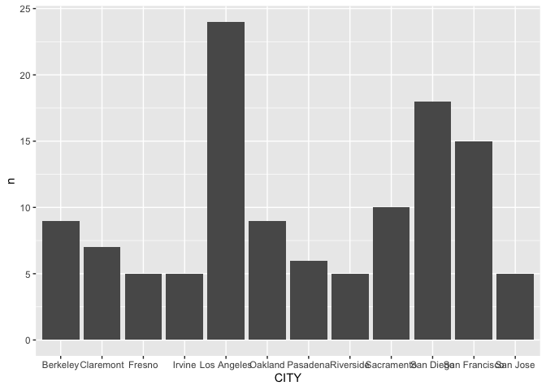
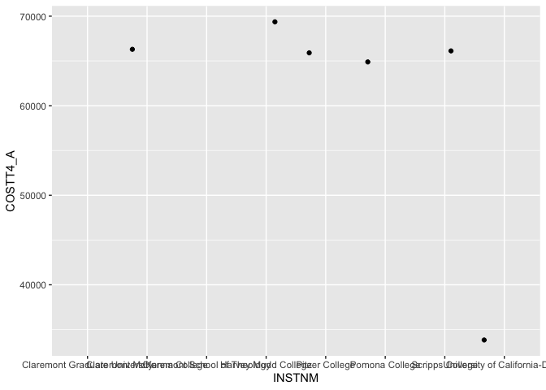
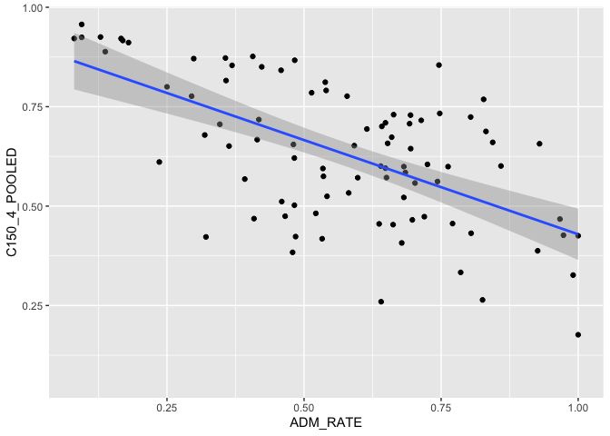
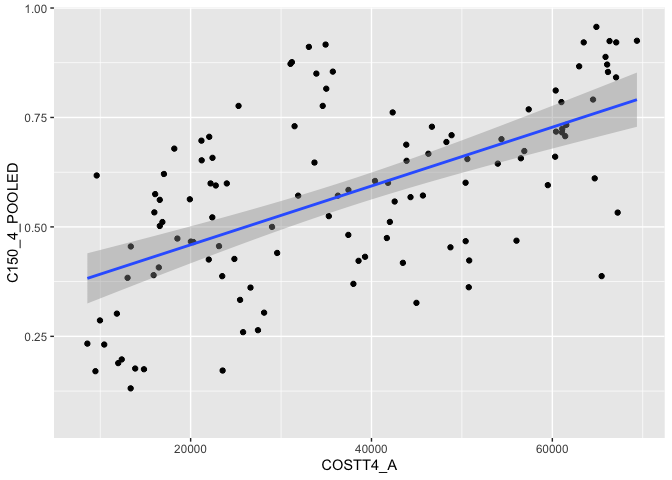
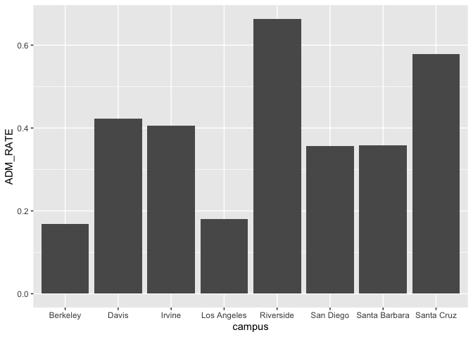
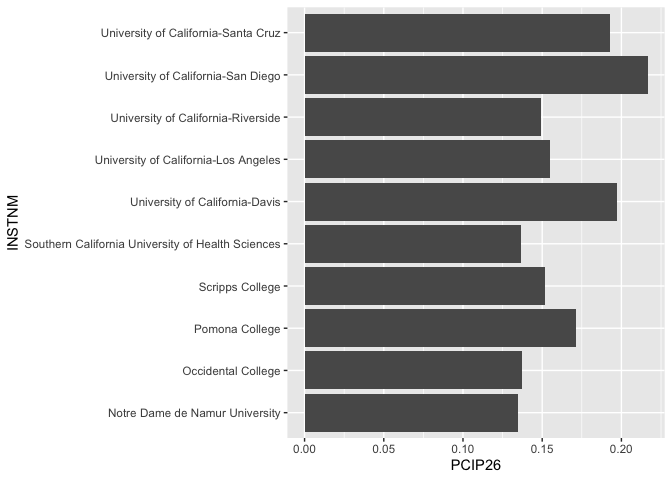

## Instructions
Answer the following questions and complete the exercises in RMarkdown. Please embed all of your code and push your final work to your repository. Your final lab report should be organized, clean, and run free from errors. Remember, you must remove the `#` for the included code chunks to run. Be sure to add your name to the author header above.  

Make sure to use the formatting conventions of RMarkdown to make your report neat and clean!  

## Load the libraries

```r
library(tidyverse)
library(janitor)
library(here)
library(naniar)
library(skimr)
```

For this homework, we will take a departure from biological data and use data about California colleges. These data are a subset of the national college scorecard (https://collegescorecard.ed.gov/data/). Load the `ca_college_data.csv` as a new object called `colleges`.

```r
colleges <- readr::read_csv("data/ca_college_data.csv")
```

```
## Rows: 341 Columns: 10
```

```
## ── Column specification ────────────────────────────────────────────────────────
## Delimiter: ","
## chr (4): INSTNM, CITY, STABBR, ZIP
## dbl (6): ADM_RATE, SAT_AVG, PCIP26, COSTT4_A, C150_4_POOLED, PFTFTUG1_EF
```

```
## 
## ℹ Use `spec()` to retrieve the full column specification for this data.
## ℹ Specify the column types or set `show_col_types = FALSE` to quiet this message.
```

```r
names(colleges)
```

```
##  [1] "INSTNM"        "CITY"          "STABBR"        "ZIP"          
##  [5] "ADM_RATE"      "SAT_AVG"       "PCIP26"        "COSTT4_A"     
##  [9] "C150_4_POOLED" "PFTFTUG1_EF"
```

The variables are a bit hard to decipher, here is a key:  

INSTNM: Institution name  
CITY: California city  
STABBR: Location state  
ZIP: Zip code  
ADM_RATE: Admission rate  
SAT_AVG: SAT average score  
PCIP26: Percentage of degrees awarded in Biological And Biomedical Sciences  
COSTT4_A: Annual cost of attendance  
C150_4_POOLED: 4-year completion rate  
PFTFTUG1_EF: Percentage of undergraduate students who are first-time, full-time degree/certificate-seeking undergraduate students  

1. Use your preferred function(s) to have a look at the data and get an idea of its structure. Make sure you summarize NA's and determine whether or not the data are tidy. You may also consider dealing with any naming issues.

```r
head(colleges)
```

```
## # A tibble: 6 × 10
##   INSTNM     CITY   STABBR ZIP    ADM_RATE SAT_AVG PCIP26 COSTT4_A C150_4_POOLED
##   <chr>      <chr>  <chr>  <chr>     <dbl>   <dbl>  <dbl>    <dbl>         <dbl>
## 1 Grossmont… El Ca… CA     92020…       NA      NA 0.0016     7956            NA
## 2 College o… Visal… CA     93277…       NA      NA 0.0066     8109            NA
## 3 College o… San M… CA     94402…       NA      NA 0.0038     8278            NA
## 4 Ventura C… Ventu… CA     93003…       NA      NA 0.0035     8407            NA
## 5 Oxnard Co… Oxnard CA     93033…       NA      NA 0.0085     8516            NA
## 6 Moorpark … Moorp… CA     93021…       NA      NA 0.0151     8577            NA
## # … with 1 more variable: PFTFTUG1_EF <dbl>
```


```r
glimpse(colleges)
```

```
## Rows: 341
## Columns: 10
## $ INSTNM        <chr> "Grossmont College", "College of the Sequoias", "College…
## $ CITY          <chr> "El Cajon", "Visalia", "San Mateo", "Ventura", "Oxnard",…
## $ STABBR        <chr> "CA", "CA", "CA", "CA", "CA", "CA", "CA", "CA", "CA", "C…
## $ ZIP           <chr> "92020-1799", "93277-2214", "94402-3784", "93003-3872", …
## $ ADM_RATE      <dbl> NA, NA, NA, NA, NA, NA, NA, NA, NA, NA, NA, NA, NA, NA, …
## $ SAT_AVG       <dbl> NA, NA, NA, NA, NA, NA, NA, NA, NA, NA, NA, NA, NA, NA, …
## $ PCIP26        <dbl> 0.0016, 0.0066, 0.0038, 0.0035, 0.0085, 0.0151, 0.0000, …
## $ COSTT4_A      <dbl> 7956, 8109, 8278, 8407, 8516, 8577, 8580, 9181, 9281, 93…
## $ C150_4_POOLED <dbl> NA, NA, NA, NA, NA, NA, 0.2334, NA, NA, NA, NA, 0.1704, …
## $ PFTFTUG1_EF   <dbl> 0.3546, 0.5413, 0.3567, 0.3824, 0.2753, 0.4286, 0.2307, …
```

```r
naniar::miss_var_summary(colleges)
```

```
## # A tibble: 10 × 3
##    variable      n_miss pct_miss
##    <chr>          <int>    <dbl>
##  1 SAT_AVG          276     80.9
##  2 ADM_RATE         240     70.4
##  3 C150_4_POOLED    221     64.8
##  4 COSTT4_A         124     36.4
##  5 PFTFTUG1_EF       53     15.5
##  6 PCIP26            35     10.3
##  7 INSTNM             0      0  
##  8 CITY               0      0  
##  9 STABBR             0      0  
## 10 ZIP                0      0
```

```r
colleges %>% 
  summarize(number_nas = sum(is.na(colleges)))
```

```
## # A tibble: 1 × 1
##   number_nas
##        <int>
## 1        949
```


```r
naniar::any_na(colleges)
```

```
## [1] TRUE
```

2. Which cities in California have the highest number of colleges?

```r
tabyl(colleges$CITY)
```

```
##        colleges$CITY  n     percent
##              Alameda  3 0.008797654
##              Anaheim  4 0.011730205
##               Angwin  1 0.002932551
##                Aptos  1 0.002932551
##               Arcata  1 0.002932551
##             Atherton  1 0.002932551
##                Azusa  1 0.002932551
##          Bakersfield  3 0.008797654
##              Barstow  1 0.002932551
##              Belmont  1 0.002932551
##             Berkeley  9 0.026392962
##            Blue Lake  1 0.002932551
##               Blythe  1 0.002932551
##              Burbank  1 0.002932551
##             Carlsbad  2 0.005865103
##          Carpinteria  1 0.002932551
##               Carson  1 0.002932551
##           Chatsworth  1 0.002932551
##                Chico  1 0.002932551
##          Chula Vista  1 0.002932551
##       Citrus Heights  1 0.002932551
##            Claremont  7 0.020527859
##               Clovis  2 0.005865103
##             Coalinga  1 0.002932551
##               Colton  1 0.002932551
##              Compton  1 0.002932551
##               Corona  1 0.002932551
##           Costa Mesa  2 0.005865103
##          Culver City  1 0.002932551
##            Cupertino  1 0.002932551
##              Cypress  1 0.002932551
##            Daly City  1 0.002932551
##                Davis  1 0.002932551
##             El Cajon  4 0.011730205
##            El Centro  1 0.002932551
##             El Monte  1 0.002932551
##           Emeryville  1 0.002932551
##            Escondido  1 0.002932551
##               Eureka  2 0.005865103
##            Fairfield  1 0.002932551
##      Fountain Valley  1 0.002932551
##              Fremont  1 0.002932551
##               Fresno  5 0.014662757
##            Fullerton  4 0.011730205
##         Garden Grove  2 0.005865103
##               Gilroy  1 0.002932551
##             Glendale  2 0.005865103
##             Glendora  1 0.002932551
##        Granada Hills  1 0.002932551
##              Hayward  3 0.008797654
##            Hollywood  2 0.005865103
##     Huntington Beach  2 0.005865103
##      Huntington Park  1 0.002932551
##             Imperial  1 0.002932551
##               Irvine  5 0.014662757
##            Kentfield  1 0.002932551
##             La Jolla  2 0.005865103
##              La Mesa  1 0.002932551
##            La Mirada  1 0.002932551
##             La Verne  1 0.002932551
##         Laguna Beach  1 0.002932551
##            Lancaster  2 0.005865103
##           Loma Linda  1 0.002932551
##           Long Beach  2 0.005865103
##      Los Altos Hills  1 0.002932551
##          Los Angeles 24 0.070381232
##               Malibu  1 0.002932551
##           Marysville  1 0.002932551
##               Merced  2 0.005865103
##          Minneapolis  1 0.002932551
##        Mission Viejo  1 0.002932551
##              Modesto  3 0.008797654
##             Monterey  2 0.005865103
##        Monterey Park  1 0.002932551
##             Moorpark  1 0.002932551
##               Moraga  1 0.002932551
##                 Napa  1 0.002932551
##        National City  1 0.002932551
##        Newport Beach  1 0.002932551
##      North Hollywood  1 0.002932551
##           Northridge  1 0.002932551
##              Norwalk  1 0.002932551
##              Oakland  9 0.026392962
##            Oceanside  3 0.008797654
##               Orange  3 0.008797654
##             Oroville  1 0.002932551
##               Oxnard  2 0.005865103
##          Palm Desert  2 0.005865103
##            Palo Alto  2 0.005865103
##             Pasadena  6 0.017595308
##            Pittsburg  1 0.002932551
##        Pleasant Hill  2 0.005865103
##               Pomona  3 0.008797654
##          Porterville  1 0.002932551
##               Quincy  1 0.002932551
##     Rancho Cucamonga  1 0.002932551
##  Rancho Palos Verdes  1 0.002932551
##              Redding  4 0.011730205
##             Redlands  1 0.002932551
##        Redondo Beach  1 0.002932551
##         Redwood City  1 0.002932551
##              Reedley  1 0.002932551
##           Ridgecrest  1 0.002932551
##            Riverside  5 0.014662757
##              Rocklin  2 0.005865103
##         Rohnert Park  1 0.002932551
##             Rosemead  1 0.002932551
##           Sacramento 10 0.029325513
##              Salinas  3 0.008797654
##          San Anselmo  1 0.002932551
##       San Bernardino  3 0.008797654
##            San Bruno  1 0.002932551
##            San Diego 18 0.052785924
##            San Dimas  1 0.002932551
##        San Francisco 15 0.043988270
##          San Jacinto  1 0.002932551
##             San Jose  5 0.014662757
##      San Luis Obispo  2 0.005865103
##           San Marcos  1 0.002932551
##            San Mateo  1 0.002932551
##            San Pablo  1 0.002932551
##            Santa Ana  2 0.005865103
##        Santa Barbara  4 0.011730205
##          Santa Clara  3 0.008797654
##        Santa Clarita  2 0.005865103
##           Santa Cruz  2 0.005865103
##          Santa Maria  2 0.005865103
##         Santa Monica  4 0.011730205
##          Santa Paula  1 0.002932551
##           Santa Rosa  3 0.008797654
##               Santee  1 0.002932551
##             Saratoga  1 0.002932551
##               Sonora  1 0.002932551
##     South Lake Tahoe  1 0.002932551
##             Stockton  4 0.011730205
##           Susanville  1 0.002932551
##               Sylmar  1 0.002932551
##                 Taft  1 0.002932551
##              Tarzana  1 0.002932551
##                Tempe  1 0.002932551
##        Thousand Oaks  1 0.002932551
##             Torrance  1 0.002932551
##              Turlock  1 0.002932551
##                Ukiah  1 0.002932551
##               Upland  1 0.002932551
##             Valencia  1 0.002932551
##              Vallejo  1 0.002932551
##          Valley Glen  1 0.002932551
##             Van Nuys  2 0.005865103
##              Ventura  3 0.008797654
##          Victorville  1 0.002932551
##              Visalia  3 0.008797654
##                Vista  1 0.002932551
##               Walnut  1 0.002932551
##          Watsonville  1 0.002932551
##                 Weed  1 0.002932551
##          West Covina  2 0.005865103
##             Whittier  3 0.008797654
##           Wilmington  1 0.002932551
##       Woodland Hills  1 0.002932551
##              Yucaipa  1 0.002932551
```


```r
most_colleges <- colleges %>% 
  count(CITY) %>% 
  arrange(desc(n))
most_colleges
```

```
## # A tibble: 161 × 2
##    CITY              n
##    <chr>         <int>
##  1 Los Angeles      24
##  2 San Diego        18
##  3 San Francisco    15
##  4 Sacramento       10
##  5 Berkeley          9
##  6 Oakland           9
##  7 Claremont         7
##  8 Pasadena          6
##  9 Fresno            5
## 10 Irvine            5
## # … with 151 more rows
```

3. Based on your answer to #2, make a plot that shows the number of colleges in the top 10 cities.

```r
most_colleges %>% 
  top_n(10, n) %>% 
  ggplot(aes(x=CITY, y=n)) +
  geom_col()
```

<!-- -->

4. The column `COSTT4_A` is the annual cost of each institution. Which city has the highest average cost? Where is it located? Claremont

```r
head(colleges)
```

```
## # A tibble: 6 × 10
##   INSTNM     CITY   STABBR ZIP    ADM_RATE SAT_AVG PCIP26 COSTT4_A C150_4_POOLED
##   <chr>      <chr>  <chr>  <chr>     <dbl>   <dbl>  <dbl>    <dbl>         <dbl>
## 1 Grossmont… El Ca… CA     92020…       NA      NA 0.0016     7956            NA
## 2 College o… Visal… CA     93277…       NA      NA 0.0066     8109            NA
## 3 College o… San M… CA     94402…       NA      NA 0.0038     8278            NA
## 4 Ventura C… Ventu… CA     93003…       NA      NA 0.0035     8407            NA
## 5 Oxnard Co… Oxnard CA     93033…       NA      NA 0.0085     8516            NA
## 6 Moorpark … Moorp… CA     93021…       NA      NA 0.0151     8577            NA
## # … with 1 more variable: PFTFTUG1_EF <dbl>
```


```r
high_cost <- colleges %>% 
  select(CITY, COSTT4_A, INSTNM) %>% 
  arrange(desc(COSTT4_A))
high_cost
```

```
## # A tibble: 341 × 3
##    CITY          COSTT4_A INSTNM                                       
##    <chr>            <dbl> <chr>                                        
##  1 Claremont        69355 Harvey Mudd College                          
##  2 Los Angeles      67225 Southern California Institute of Architecture
##  3 Los Angeles      67064 University of Southern California            
##  4 Los Angeles      67046 Occidental College                           
##  5 Claremont        66325 Claremont McKenna College                    
##  6 Malibu           66152 Pepperdine University                        
##  7 Claremont        66060 Scripps College                              
##  8 Claremont        65880 Pitzer College                               
##  9 San Francisco    65453 San Francisco Art Institute                  
## 10 Claremont        64870 Pomona College                               
## # … with 331 more rows
```

5. Based on your answer to #4, make a plot that compares the cost of the individual colleges in the most expensive city. Bonus! Add UC Davis here to see how it compares :>).

```r
high_cost %>% 
  filter(CITY == "Claremont" | CITY =="Davis") %>% 
  ggplot(aes(x=INSTNM, y=COSTT4_A)) +
  geom_jitter()
```

```
## Warning: Removed 2 rows containing missing values (geom_point).
```

<!-- -->

6. The column `ADM_RATE` is the admissions rate by college and `C150_4_POOLED` is the four-year completion rate. Use a scatterplot to show the relationship between these two variables. What do you think this means? The harder it is to get in, the more likely you will complete 4 years.

```r
colleges %>% 
  select(ADM_RATE, C150_4_POOLED) %>% 
  ggplot(aes(x=ADM_RATE, y=C150_4_POOLED)) +
  geom_point()+
  geom_smooth(method=lm, se=T)
```

```
## `geom_smooth()` using formula 'y ~ x'
```

```
## Warning: Removed 251 rows containing non-finite values (stat_smooth).
```

```
## Warning: Removed 251 rows containing missing values (geom_point).
```

<!-- -->

7. Is there a relationship between cost and four-year completion rate? (You don't need to do the stats, just produce a plot). What do you think this means? higher the cost, more likely to complete 4 years.

```r
names(colleges)
```

```
##  [1] "INSTNM"        "CITY"          "STABBR"        "ZIP"          
##  [5] "ADM_RATE"      "SAT_AVG"       "PCIP26"        "COSTT4_A"     
##  [9] "C150_4_POOLED" "PFTFTUG1_EF"
```


```r
colleges %>% 
  select(COSTT4_A, C150_4_POOLED) %>% 
  ggplot(aes(x=COSTT4_A, y=C150_4_POOLED)) +
  geom_point()+
  geom_smooth(method=lm, se=T)
```

```
## `geom_smooth()` using formula 'y ~ x'
```

```
## Warning: Removed 225 rows containing non-finite values (stat_smooth).
```

```
## Warning: Removed 225 rows containing missing values (geom_point).
```

<!-- -->

8. The column titled `INSTNM` is the institution name. We are only interested in the University of California colleges. Make a new data frame that is restricted to UC institutions. You can remove `Hastings College of Law` and `UC San Francisco` as we are only interested in undergraduate institutions.

```r
head(colleges)
```

```
## # A tibble: 6 × 10
##   INSTNM     CITY   STABBR ZIP    ADM_RATE SAT_AVG PCIP26 COSTT4_A C150_4_POOLED
##   <chr>      <chr>  <chr>  <chr>     <dbl>   <dbl>  <dbl>    <dbl>         <dbl>
## 1 Grossmont… El Ca… CA     92020…       NA      NA 0.0016     7956            NA
## 2 College o… Visal… CA     93277…       NA      NA 0.0066     8109            NA
## 3 College o… San M… CA     94402…       NA      NA 0.0038     8278            NA
## 4 Ventura C… Ventu… CA     93003…       NA      NA 0.0035     8407            NA
## 5 Oxnard Co… Oxnard CA     93033…       NA      NA 0.0085     8516            NA
## 6 Moorpark … Moorp… CA     93021…       NA      NA 0.0151     8577            NA
## # … with 1 more variable: PFTFTUG1_EF <dbl>
```


```r
uc_institutions <- colleges %>% 
  filter_all(any_vars(str_detect(., pattern = "University of California")))
uc_institutions
```

```
## # A tibble: 10 × 10
##    INSTNM     CITY   STABBR ZIP   ADM_RATE SAT_AVG PCIP26 COSTT4_A C150_4_POOLED
##    <chr>      <chr>  <chr>  <chr>    <dbl>   <dbl>  <dbl>    <dbl>         <dbl>
##  1 Universit… La Jo… CA     92093    0.357    1324  0.216    31043         0.872
##  2 Universit… Irvine CA     92697    0.406    1206  0.107    31198         0.876
##  3 Universit… River… CA     92521    0.663    1078  0.149    31494         0.73 
##  4 Universit… Los A… CA     9009…    0.180    1334  0.155    33078         0.911
##  5 Universit… Davis  CA     9561…    0.423    1218  0.198    33904         0.850
##  6 Universit… Santa… CA     9506…    0.578    1201  0.193    34608         0.776
##  7 Universit… Berke… CA     94720    0.169    1422  0.105    34924         0.916
##  8 Universit… Santa… CA     93106    0.358    1281  0.108    34998         0.816
##  9 Universit… San F… CA     9410…   NA          NA NA           NA        NA    
## 10 Universit… San F… CA     9414…   NA          NA NA           NA        NA    
## # … with 1 more variable: PFTFTUG1_EF <dbl>
```

Remove `Hastings College of Law` and `UC San Francisco` and store the final data frame as a new object `univ_calif_final`.

```r
univ_calif_final <- uc_institutions %>%  
  filter(INSTNM != "University of California-Hastings College of Law" & INSTNM != "University of California-San Francisco")
univ_calif_final
```

```
## # A tibble: 8 × 10
##   INSTNM      CITY   STABBR ZIP   ADM_RATE SAT_AVG PCIP26 COSTT4_A C150_4_POOLED
##   <chr>       <chr>  <chr>  <chr>    <dbl>   <dbl>  <dbl>    <dbl>         <dbl>
## 1 University… La Jo… CA     92093    0.357    1324  0.216    31043         0.872
## 2 University… Irvine CA     92697    0.406    1206  0.107    31198         0.876
## 3 University… River… CA     92521    0.663    1078  0.149    31494         0.73 
## 4 University… Los A… CA     9009…    0.180    1334  0.155    33078         0.911
## 5 University… Davis  CA     9561…    0.423    1218  0.198    33904         0.850
## 6 University… Santa… CA     9506…    0.578    1201  0.193    34608         0.776
## 7 University… Berke… CA     94720    0.169    1422  0.105    34924         0.916
## 8 University… Santa… CA     93106    0.358    1281  0.108    34998         0.816
## # … with 1 more variable: PFTFTUG1_EF <dbl>
```

Use `separate()` to separate institution name into two new columns "UNIV" and "CAMPUS".

```r
univ_calif_final <- univ_calif_final %>% 
  separate(INSTNM, c("univ", "campus"), sep="-")
univ_calif_final
```

```
## # A tibble: 8 × 11
##   univ  campus CITY  STABBR ZIP   ADM_RATE SAT_AVG PCIP26 COSTT4_A C150_4_POOLED
##   <chr> <chr>  <chr> <chr>  <chr>    <dbl>   <dbl>  <dbl>    <dbl>         <dbl>
## 1 Univ… San D… La J… CA     92093    0.357    1324  0.216    31043         0.872
## 2 Univ… Irvine Irvi… CA     92697    0.406    1206  0.107    31198         0.876
## 3 Univ… River… Rive… CA     92521    0.663    1078  0.149    31494         0.73 
## 4 Univ… Los A… Los … CA     9009…    0.180    1334  0.155    33078         0.911
## 5 Univ… Davis  Davis CA     9561…    0.423    1218  0.198    33904         0.850
## 6 Univ… Santa… Sant… CA     9506…    0.578    1201  0.193    34608         0.776
## 7 Univ… Berke… Berk… CA     94720    0.169    1422  0.105    34924         0.916
## 8 Univ… Santa… Sant… CA     93106    0.358    1281  0.108    34998         0.816
## # … with 1 more variable: PFTFTUG1_EF <dbl>
```

9. The column `ADM_RATE` is the admissions rate by campus. Which UC has the lowest and highest admissions rates? Produce a numerical summary and an appropriate plot.

```r
highest_adm <- univ_calif_final %>% 
  select(campus, ADM_RATE) %>% 
  arrange(desc(ADM_RATE))
highest_adm
```

```
## # A tibble: 8 × 2
##   campus        ADM_RATE
##   <chr>            <dbl>
## 1 Riverside        0.663
## 2 Santa Cruz       0.578
## 3 Davis            0.423
## 4 Irvine           0.406
## 5 Santa Barbara    0.358
## 6 San Diego        0.357
## 7 Los Angeles      0.180
## 8 Berkeley         0.169
```

```r
highest_adm %>% 
  ggplot(aes(x=campus, y=ADM_RATE))+
  geom_col()
```

<!-- -->

10. If you wanted to get a degree in biological or biomedical sciences, which campus confers the majority of these degrees? Produce a numerical summary and an appropriate plot.


```r
bio_campuses <- colleges %>%
  top_n(10, PCIP26) %>% 
  select(PCIP26, INSTNM) %>% 
  arrange(desc(PCIP26))
bio_campuses
```

```
## # A tibble: 10 × 2
##    PCIP26 INSTNM                                           
##     <dbl> <chr>                                            
##  1  0.216 University of California-San Diego               
##  2  0.198 University of California-Davis                   
##  3  0.193 University of California-Santa Cruz              
##  4  0.171 Pomona College                                   
##  5  0.155 University of California-Los Angeles             
##  6  0.152 Scripps College                                  
##  7  0.149 University of California-Riverside               
##  8  0.137 Occidental College                               
##  9  0.136 Southern California University of Health Sciences
## 10  0.135 Notre Dame de Namur University
```


```r
bio_campuses %>% 
  ggplot(aes(x=INSTNM, y=PCIP26))+
  geom_col() +
  coord_flip()
```

<!-- -->

## Knit Your Output and Post to [GitHub](https://github.com/FRS417-DataScienceBiologists)
